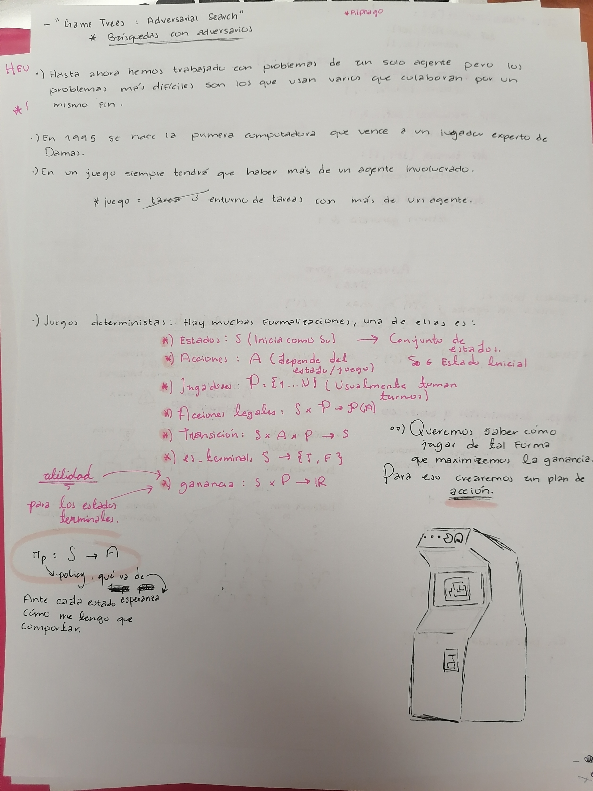
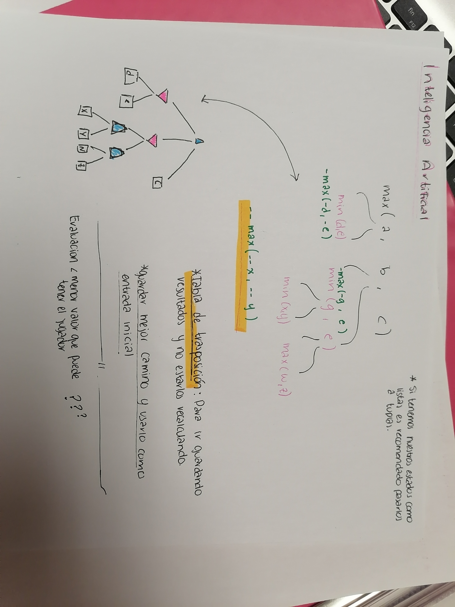
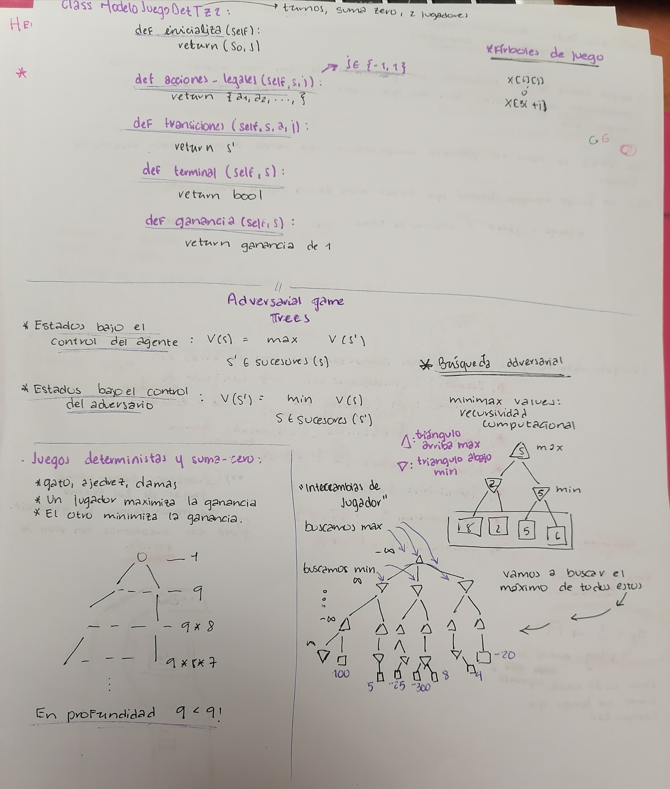
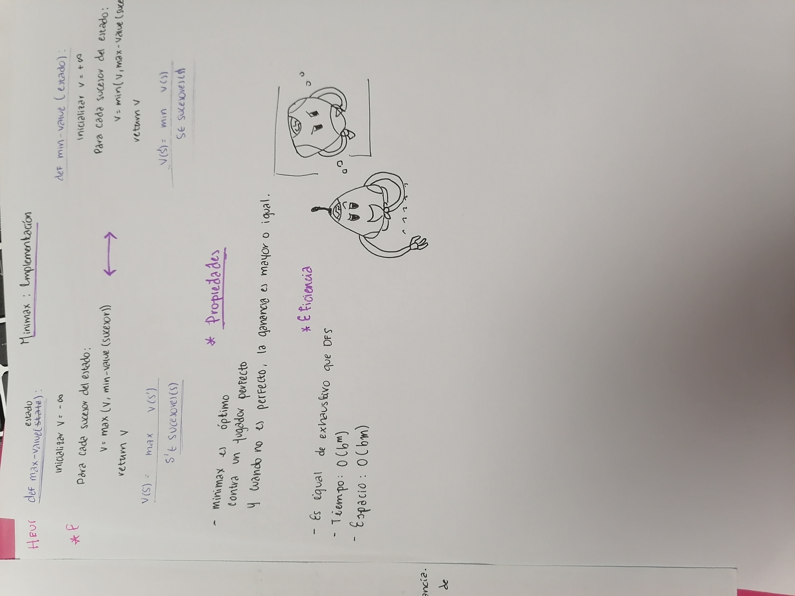
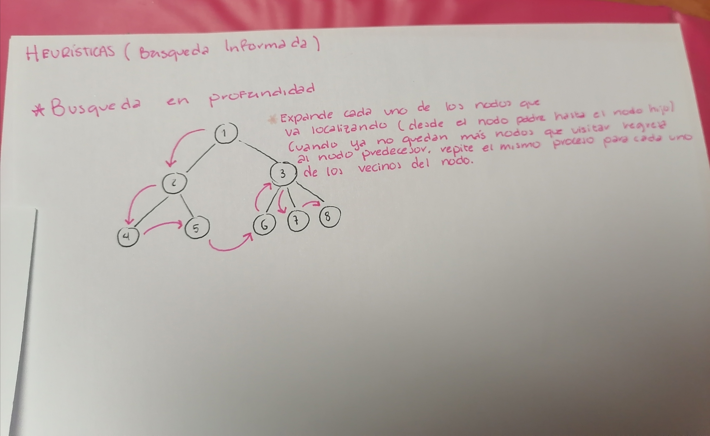
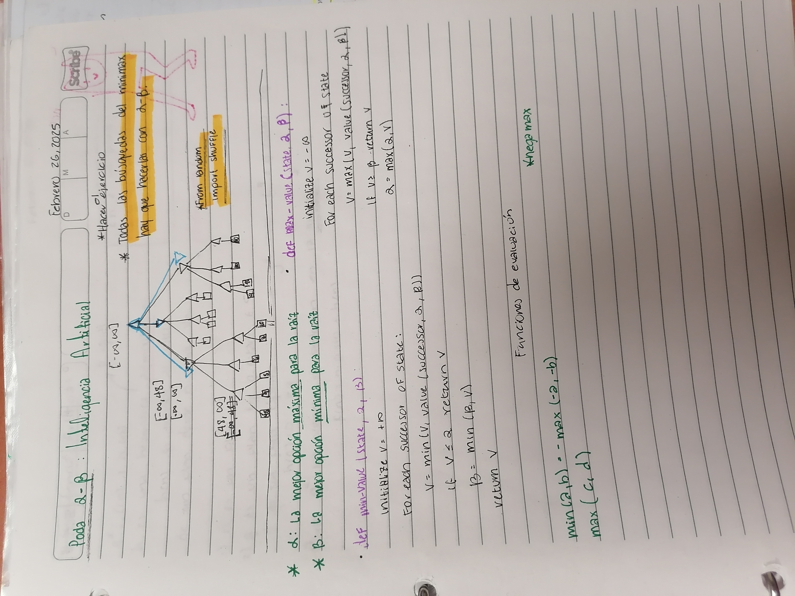

# Apuntes de Inteligencia Artificial - Búsqueda Adversarial

## Imagen 1: Introducción a Game Trees y Juegos Deterministas

---

## Imagen 2: Minimax y Tablas de Transposición

---

## Imagen 3: Modelo de Juego Determinista y Adversarial Game Trees

## Imagen 4

## Imagen 5: 

## Imagen 6: 

